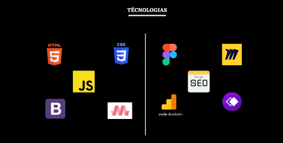

## Eaee, eu me chamo Guilherme Oliveira!!!

  
  
  

 
  
  
   
  <strong>Tecnologias Dominadas</strong>

 
<table>
  <th>
    
  </th>
  <th>
      <ul>
        <li>HTML5</li>
        <li>CSS 3</li>
        <li>JavaScript</li>
        <li>Materialize</li>
        <li>Bootstrap</li>
      </ul>
  </th>
    <th>
      <ul>
        <li>Figma</li>
        <li>Miro</li>
        <li>whimsical</li>
        <li>Google analytic</li>
        <li>Google SEO</li>
      </ul>
  </th>
</table>

